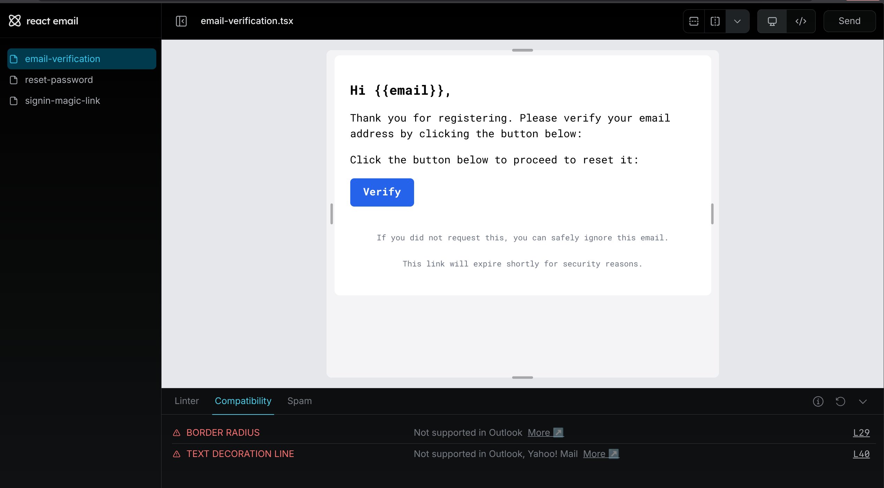

# Cowors Backend API ⚡

Advanced Nest.js backend for the Cowors coworking platform.

## Local Ports Policy (Strict)

This backend MUST run on port `5001`.

- Set `APP_PORT=5001` in your `.env`.
- Do not override with other ports in any environment.
- If a port conflict occurs, stop the conflicting process and retry — no fallback ports are allowed.

Example `.env` snippet:

```env
APP_PORT=5001
APP_WORKER_PORT=8001
```

## Features📦

- [x] Nest.js with Fastify
- [x] PostgreSQL with TypeORM
- [x] [Better Auth](https://www.better-auth.com/) for complete authentication. Handles authentication kinds like email/password, OAuth, Magic Link, Pass Keys, Two-Factor Authentication, Session Management, etc. [Learn More](#better-auth)
- [x] REST, GraphQL & WebSocket API
- [x] Websocket using Socket.io via Redis Adapter(For future scalability with clusters)
- [x] Swagger Documentation and API versioning for REST API
- [x] Automatic API generation on the frontend using OpenAPI Codegen [Learn More](#automatic-api-generation-on-the-frontend-)
- [x] BullMQ for Queues. Bull board UI to inspect your jobs
- [x] Worker server for processing background tasks like queues
- [x] [React Email](https://react.email/) for email template management. [MailPit](https://github.com/axllent/mailpit) SMTP server for local email testing. [Learn More](#email-management-)
- [x] Caching using Redis
- [x] Pino for Logging
- [x] Rate Limiter using Redis
- [x] Graceful Shutdown
- [x] Server & Database monitoring with Prometheus & Grafana [Learn More](#server--database-monitoring-)
- [x] Offset and Cursor based Pagination
- [x] Local or Remote File Uploads (AWS S3)
- [x] Sentry
- [x] Testing with Jest
- [x] Internationalization using i18n
- [x] pnpm
- [x] Docker: Dev & Prod ready from a single script [Learn More](#docker-)
- [x] Github Actions
- [x] Commitlint & Husky
- [x] SWC instead of Webpack
- [x] Dependency Graph Visualizer [Learn More](#dependency-graph-)
- [x] Database Entity Relationship Diagram Generator [Learn More](#database-entity-relationship-diagram️)

## Development:

- Make `.env` files ready:

```
cp ./.env.example ./.env
cp ./.env.docker.example ./.env.docker
```

- Start Docker containers:

```
pnpm docker:dev:up
```

- Run migrations:

```
docker exec -it cowors-server sh
pnpm migration:up
```

### CORS Configuration

The backend reads allowed origins from the `APP_CORS_ORIGIN` environment variable and enables `credentials: true`.

- Set admin app origin during local development:

```
APP_CORS_ORIGIN=http://localhost:3001
```

- You can specify multiple origins as a comma-separated list. `http://127.0.0.1` and `https://www.*` variants are automatically included:

```
APP_CORS_ORIGIN=http://localhost:3001,https://example.com
```

- Supported values: `true` (allow all same-origin requests), `false` (disable CORS), `*` (allow any origin), or a comma-separated list of URLs.

Ensure frontend requests include cookies when needed; for fetch, use `credentials: 'include'`.

### Better Auth🔒

Rolling our own auth is doable but maintaining all kinds of authentication types ourselves has been found out to be a challenging task. Moreover, rolling our own auth poses security risks. That's why this boilerplate uses [Better Auth](https://www.better-auth.com/) for everything related to authentication. All of the industry standard authentication kinds are ready to be used out of the box so that you focus on building features rather than worrying about auth shenanigans:

- Email/Password
- OAuth
- Magic Link
- Pass Keys
- Two Factor Authentication
- Role based Authentication & Authorization
- Session Management

You can find the frontend client setup [here](https://github.com/niraj-khatiwada/ultimate-nestjs-client). You can find your auth API documentation by visiting `/api/auth/reference`


### Automatic API Generation on the Frontend 🚀

You can automatically generate and use all of your backend API in frontend in just one command, thanks to Swagger and OpenAPI spec. Running `pnpm codegen` on the frontend (example [repo](https://github.com/niraj-khatiwada/ultimate-nestjs-client)) will automatically generate all API's bootstrapped with [Tanstack Query](https://tanstack.com/query/latest) ready to be used with just one import. See complete example [here](https://github.com/niraj-khatiwada/ultimate-nestjs-client)


### Server & Database Monitoring 🚨

Prometheus & Grafana are available with Docker setup only. You might only need to monitor your server or database when the user base grows or when you want to debug some specific issues. That's why this step is completely optional. If you want to monitor your server or database, just enable `monitoring` profile in your `.env` i.e. `COMPOSE_PROFILES=monitoring`.

Server Monitoring Dashboard:


Database Monitoring Dashboard:


### Docker 🐬

##### For local development:

- Start container:

```
pnpm docker:dev:up
```

- Stop container:

```
pnpm docker:dev:down
```

##### For prod build:

- Start container:

```
pnpm docker:prod:up
```

- Stop container:

```
pnpm docker:prod:down
```

##### Deployment:

```
sh ./bin/deploy.sh
```

or run workflow `.github/workflows/main.yml` via GitHub Actions.

### Email Management 📬

#### React Email

Let's face it, it is not practical to just create some random html email templates and inject your variables and send it to your clients. Your email templates must be checked for spam, CSS compatibility for different email clients, accessibility, responsiveness, etc. You need to make sure all these checks are passed so that your emails don't end up in spam folder. [React Email](https://react.email/) is perfect fit for this. It uses React and provides many responsive email component blocks so that you can test all of the things mentioned earlier in your local development.

<b>NOTE</b>: We use React Email only in local development. We don't ship React and it's packages in production at all(<i>you can see that all of the React packages are dev only</i>). After our email templates have been created, we convert the `.tsx` files into static html files at build time and NodeMailer uses that html file from our backend. All of these things are handled automatically, you don't have to do any extra setup.

- React Email dev server: See all of your email templates in Web UI.

```
pnpm email:dev
```

- Build email templates(Handled): Convert `.tsx` templates file into html(`.hbs`). This is already handled in post build (`build` script).

```
pnpm email: build
```

- Watch Email(Handled): Watch your `.tsx` email files inside `templates/` folder and convert them to html(`.hbs`). This is already handled when you run your Nest.js server (in `start:dev` script).

```
pnpm email:watch
```



### MailPit SMTP Server

In local you can easily test your email by using [MailPit](https://github.com/axllent/mailpit) email client that ships with it's own SMTP server. The SMTP server will automatically run when you run your docker in development mode:

```
pnpm docker:dev:up
```

After that, just visit `http://localhost:<DOCKER_MAIL_CLIENT_PORT>`. You can find `DOCKER_MAIL_CLIENT_PORT` on `.env.docker`. By default, it will run on `http://localhost:18025`


### Dependency Graph 📈

Visualize all of your project modules and their dependencies. Also, detect circular dependencies.

NOTE: Make sure [Graphviz](https://www.graphviz.org/) is installed first.

- All dependencies:

```
pnpm graph:app
```

- Only circular dependencies:

```
pnpm graph:circular
```

<figure>

</figure>

### Database Entity Relationship Diagram🛢️

Visualize your database entities and their relationships.

```
pnpm erd:generate
```

<figure>

</figure>

This boilerplate is extended from [nestjs-boilerplate](https://github.com/vndevteam/nestjs-boilerplate?tab=readme-ov-file)
## Repository Structure Reference

For an overview of the monorepo layout and conventions, see `docs/STRUCTURE.md`.
